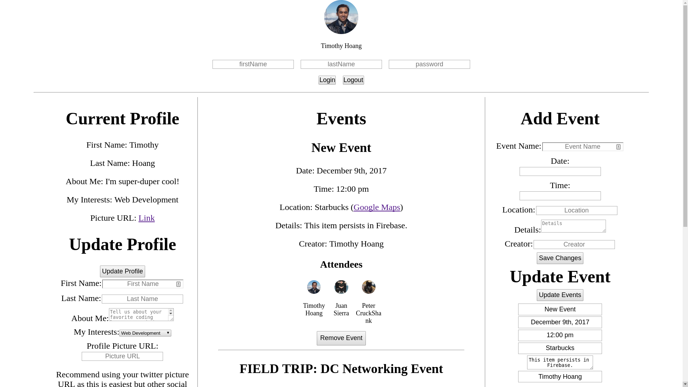

<figure><figcaption style=" text-align: center;">Respondez App</figcaption></figure>

# About
- Hello World! The Respondez App was named off of the popular expression "respondez s'il vous plait", or R.S.V.P. for short 
- I want to built this out of the desire for our Free Code Camp Ashburn Group so we can manage our events external from popular platforms such as Facebook or Meetup

## Features
- Log in with your Github account
- Events, attendees, and log in state persists even after refresh
- Create new events, edit, delete events
- Create and delete comments under events
- View user github description on hover over rsvp photo
- Add and remove rsvp's to different events
- View date and time comment was posted on hover

## Technologies
- Create-React-App
- Firebase for storage
- Immutability-Helper for deep state manipulation
- Github Pages for deployment 
- See package.json for other minor technologies

# To run this project
## Method 1: Visit deployed website
1. Visit https://timh1203.github.io/respondez-app/ to view deployed app

## Method 2: Download repo to view on local computer
1. Have NPM and NodeJS installed on your computer
2. Copy the URL address this repo: https://github.com/timh1203/respondez-app.git
3. Open the terminal and go to the directory of choice, then run `git clone https://github.com/timh1203/respondez-app.git` 
3. Run `npm install` to install all the depedencies of the app
4. Run `npm start` to start the server
5. The app should auto-load with Create React App, otherwise, navigate to `localhost:3000` on your browser

==========
This project was bootstrapped with [Create React App](https://github.com/facebookincubator/create-react-app).

You can find the most recent version of this guide [here](https://github.com/facebookincubator/create-react-app/blob/master/packages/react-scripts/template/README.md).